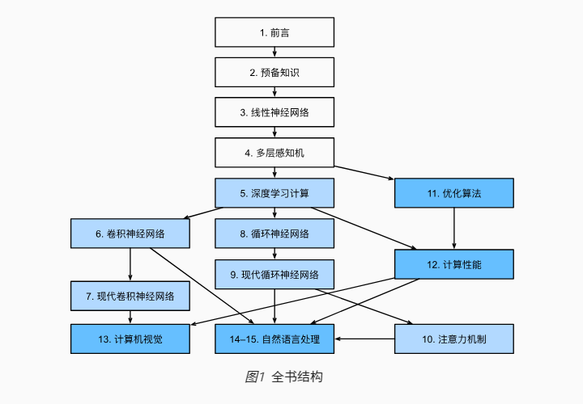
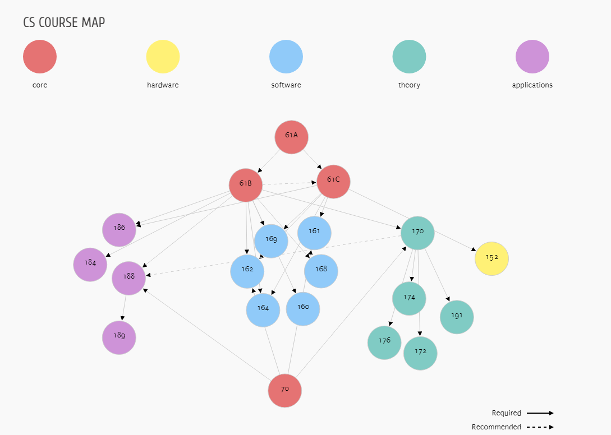
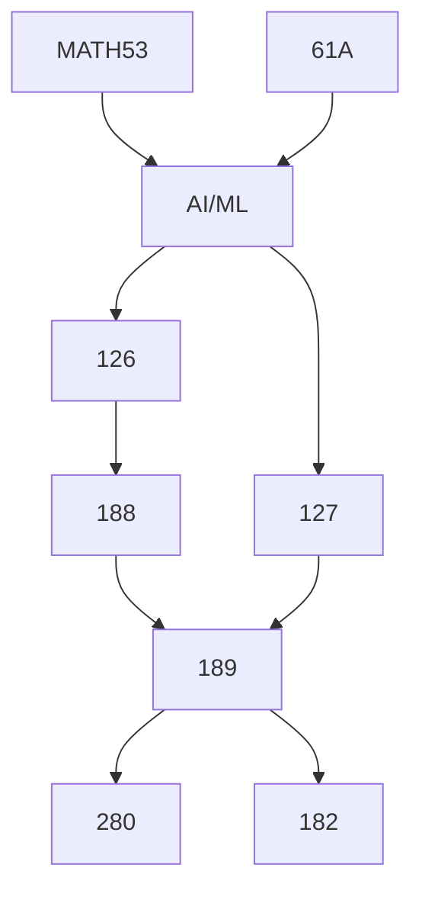

```mermaid
graph TD;
    A-->B;
    A-->C;
    B-->D;
    C-->D;
```

MATH53 CS61A B C

(Least Square, OMP, SVD/PCA)

AI/ML

126 127  170

188 189

```mermaid
graph TD
MATH53 --> AI/ML
61A --> AI/ML --> 126 --> 188 --> 189 --> 280
AI/ML --> 127 --> 189 --> 182
```
